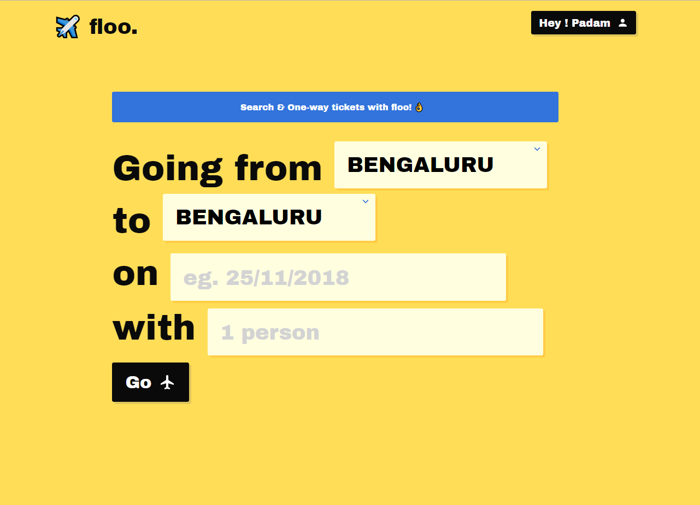
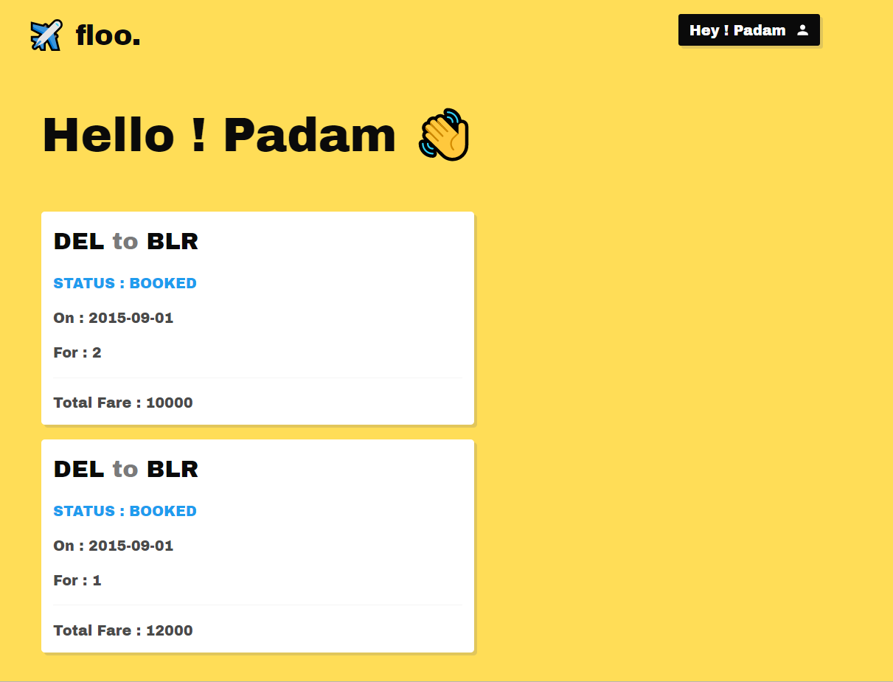
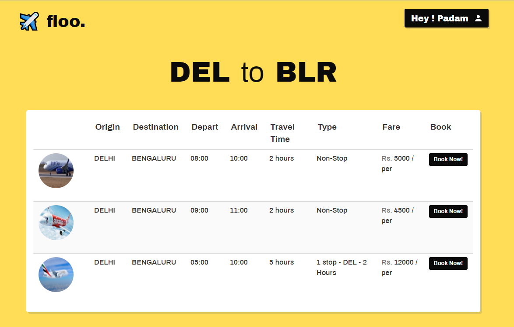

# floo
✈️ Flight Booking web app built for One Direct Challenge

# Implemented Features 

* Login / Signup new Users
* Search Flights - try( DEL to BLR , DEL to JAI)
* Booking option
* All User Bookings

# Screenshots

 
  

# Requirements

Clone floo at your desired location `git clone https://github.com/padamsethia/floo`

Install Mysql and create a database `floo` . Also configure your db URI in `config.py`. 
By default the user is `root` at `localhost` database name `floo`.

Run `pip install -r requirements.txt`

Next , 

Ready the test data by running this script `python testdata`

Finally run `python run.py`

View the application in the browser at `127.0.0.1:8080`
